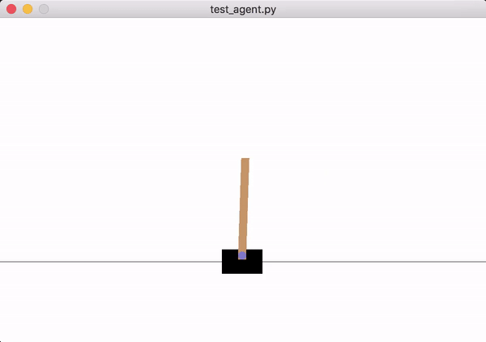

# OpenAI gym playground
A collection of projects to solve OpenAI gym environments with reinforcement learning.

## Solving CartPole-v0 with MCC

### Reinforcement Algorithm

To get started I choose Monte Carlo Control (MCC). Here the agent collects the new obeservation during one episode and wait to the end of the episode before using these to train the policy network. 

Since the CartPole environment always terminates and has short episodes MCC works well.

Check out [monte_carlo_control.py](./monte_carlo_control.py) for implementation details.

### Agent/Policy Network

As policy network a 1-layer neural network is used to approximate the Q-value function. The approximated Q-values given by the policy are used as a probability distribution to choose sample new actions for a given state.

It is implemented in TensorFlow and heavily inspired by [Matthew Rahtz's Pong agent](https://github.com/mrahtz/tensorflow-rl-pong)

Check out [policy_network.py](./policy_network.py) for implementation details.

